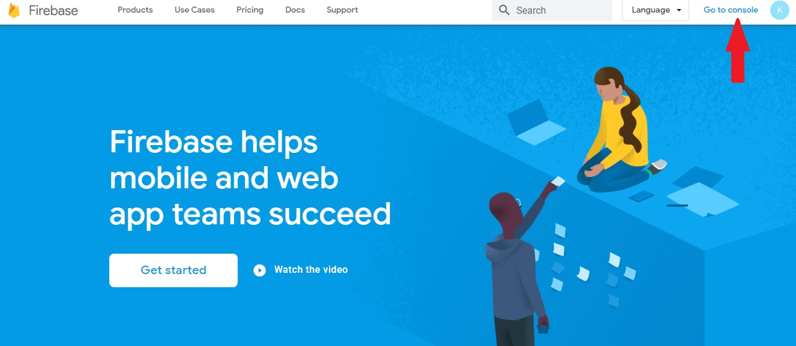
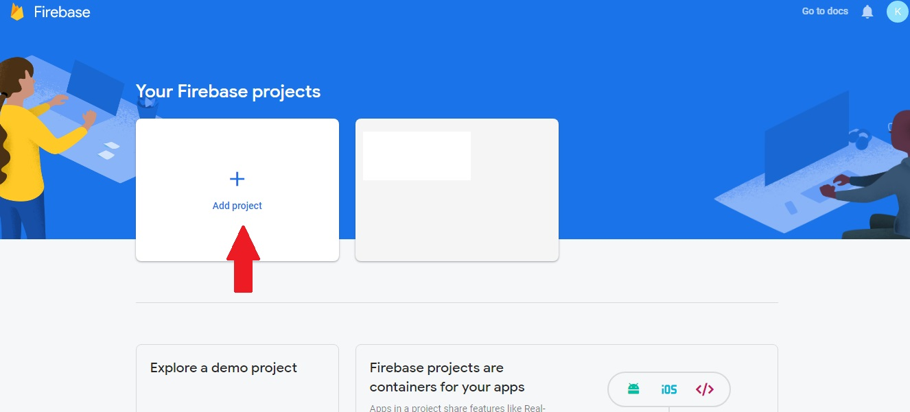
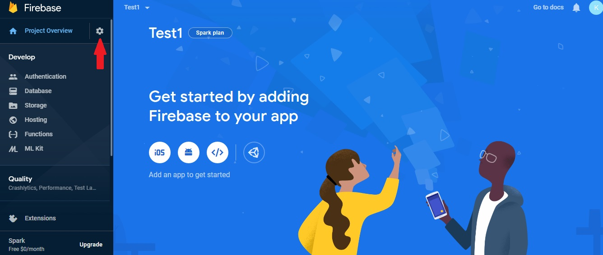
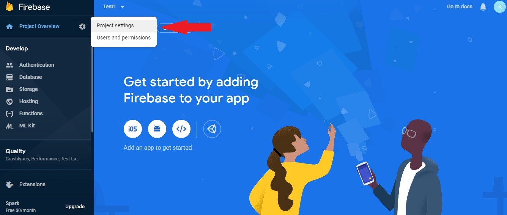
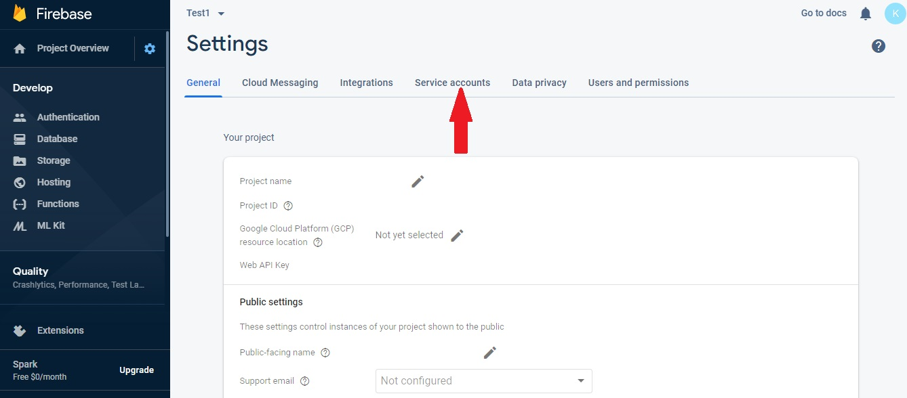
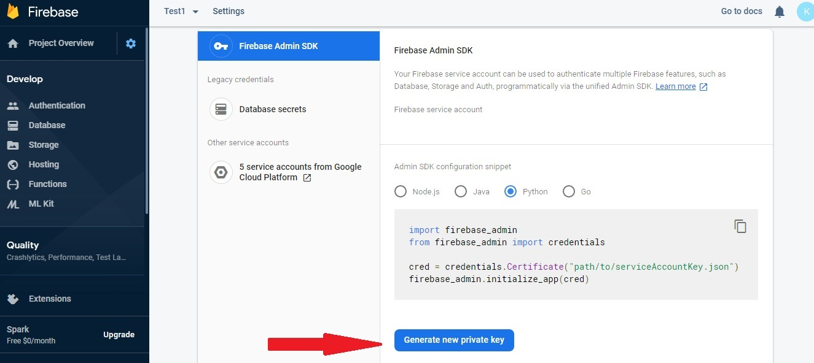

### A simple project to understand web crawling with FireBase.

### Tasks:

###### 1. create crawler
###### 2. clean up crawled data
###### 3. save data to firebase
###### 4. query data from firebase

##### Codes: [https://github.com/kkhng/WebCrawlxFirebase]( https://github.com/kkhng/WebCrawlxFirebase)

### How to create service account?

###### Follow below pictures for steps to generate your private key, once you click on the generate private key button, you will get a file dowloaded and that file is your private key information. Next, you just have to copy all the information in the file and paste to the service account section of the codes file (webcrawling.py).

1.  

2.

3.

4.

5.

6.

